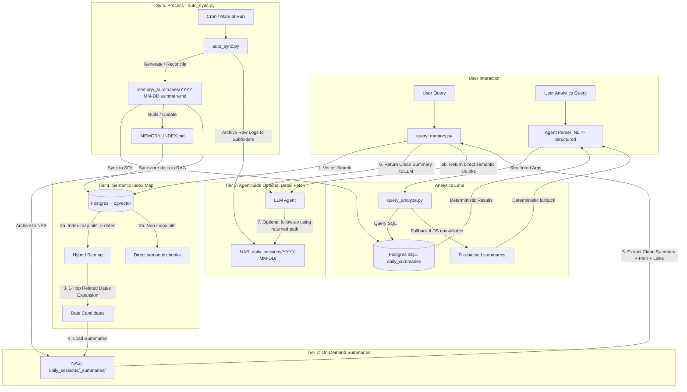
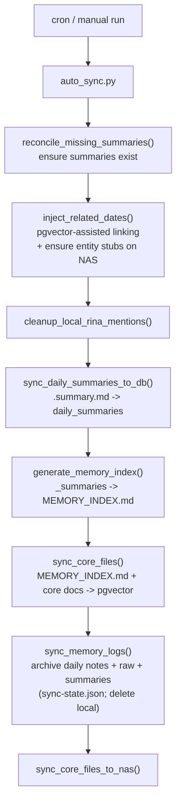
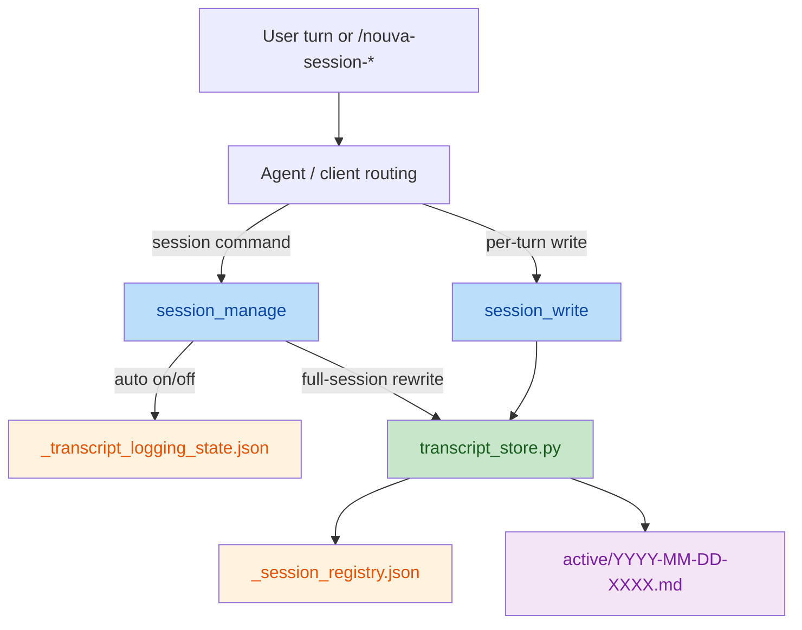
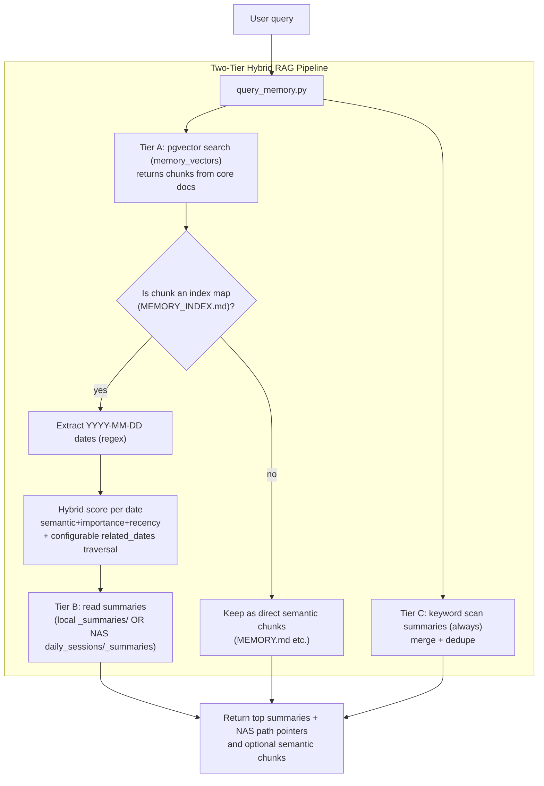
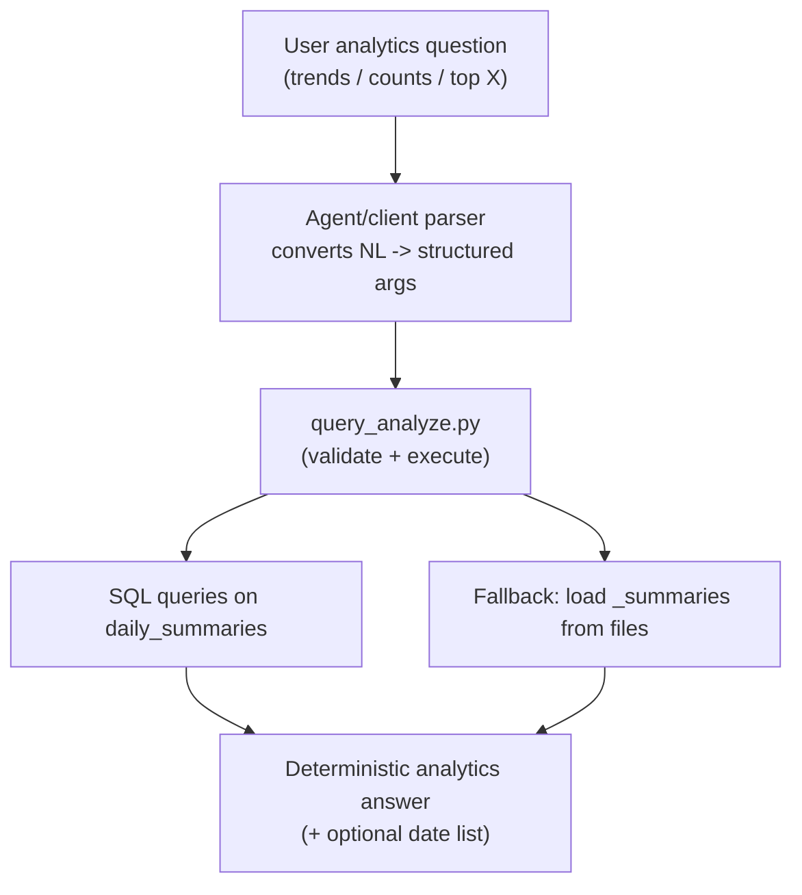

# ARCHITECTURE

This document describes the current memory architecture implemented in the `memory_engine` skill. It focuses on how the system avoids classic RAG failure modes (vector dilution, noisy logs, time-based aggregation inaccuracies) by using a hybrid 2-lane memory design:

- A semantic recall (RAG) lane backed by Postgres + pgvector (good for “find the relevant day / concept”).
- A deterministic analytics lane backed by plain SQL over structured daily summaries (good for “counts / trends / top X / date lists”).

This document reflects the current codebase only and focuses on the architecture that is implemented today.

---

## 1. Key Concepts (What Exists Today)

### 1.1 Source Files

The system operates on a small set of file types:

- Daily notes: `YYYY-MM-DD.md`
- Raw transcripts: `YYYY-MM-DD-*.md` while active, then archived under `daily_sessions/YYYY-MM-DD/`
- Daily summaries: `_summaries/YYYY-MM-DD.summary.md` in active memory, then `daily_sessions/_summaries/YYYY-MM-DD.summary.md` after archival (Markdown with YAML frontmatter)
- Core knowledge docs: `MEMORY.md`, `SOUL.md`, `USER.md`, `IDENTITY.md`, `AGENTS.md`, `INFRASTRUCTURE.md`, and `MEMORY_INDEX.md`

Daily summaries are the "junction format": they power both analytics and the memory index. They are not directly embedded into pgvector one-by-one; instead, they are parsed into SQL rows and condensed into `MEMORY_INDEX.md`, which then participates in semantic recall.

### 1.2 Storage Backends

#### A. Semantic Recall (Postgres + pgvector)

- Table: `memory_vectors`
- Content: embeddings for core knowledge docs (and the index map docs that help bridge query → date)
- Query method: cosine distance search via raw SQL

Code references:
- Vector table schema: [init_db.py](scripts/db/init_db.py)
- Vector search implementation: [db_helper.py](scripts/db/db_helper.py)

#### B. Deterministic Analytics (Postgres SQL)

- Table: `daily_summaries`
- Content: one row per date parsed from `.summary.md` YAML fields (arrays + scalar fields)
- Query method: pure SQL aggregations, with GIN indexes over arrays

Code references:
- Analytics schema + queries: [analytics_repo.py](scripts/db/analytics_repo.py)
- Sync `.summary.md` → `daily_summaries`: [analytics_sync.py](scripts/sync/analytics_sync.py)

---

## 2. End-to-End Architecture Overview

This diagram provides a high-level overview of the implemented memory engine, showing how user queries (both semantic recall and deterministic analytics), the retrieval pipeline, the databases, and the background sync process interact. It intentionally separates the server/runtime flow from the optional follow-up behavior performed by the calling agent after the server returns results. It also shows that semantic recall can produce either date candidates from `MEMORY_INDEX.md` or direct semantic chunks from other core docs.

---

## 3. Sync Pipeline (auto_sync.py)

*(This section details the **Sync Process** and database ingestion paths shown in the End-to-End Architecture Overview)*

The sync process is orchestrated by `auto_sync.py` and is designed to be incremental and idempotent:

- `sync-state.json` is used to drive incremental archival for daily sessions.
- Summaries are reconciled/created before archival, so the summary layer stays available even after local raw files are cleaned.
- The summary layer feeds two different downstream products: `daily_summaries` rows for deterministic analytics, and `MEMORY_INDEX.md` for semantic date recall in pgvector.
- The pgvector lane receives core docs such as `MEMORY_INDEX.md`, `MEMORY.md`, `USER.md`, and related files, not raw `.summary.md` files directly.

Code reference:
- Orchestrator: [auto_sync.py](scripts/auto_sync.py)

### 3.1 Diagram: Sync Steps (High Level)

### 3.2 Note on LLM Usage

Summary generation uses a configurable LLM endpoint/model from `memory_config.json` via [summary_sync.py](scripts/sync/summary_sync.py). `llm.timeout_seconds` is configurable, while `temperature` currently falls back to the script default when omitted from config. If summaries already exist (pre-generated), the rest of the pipeline still works without calling an LLM.

### 3.3 Transcript Write Mechanism

Raw transcript writing is now handled as a separate operational path from the sync pipeline. This path is designed for **active-session logging** in the writable memory workspace before archival happens.

There are two write modes:

- **Per-turn write** via `session_write`: append one completed `user` / `assistant` exchange to the active transcript for a given `stable_session_id`.
- **Full-session rewrite** via `session_manage` with `/nouva-session-write`: rewrite the active transcript file from the complete in-memory turn list for the current session.

Both modes share the same storage logic:

- Active transcript files live directly under the active memory directory using the existing naming pattern `YYYY-MM-DD-XXXX.md`.
- Each transcript file begins with a stable session header:
  - `# Session: <original session timestamp>`
  - `Parent Day: [[YYYY-MM-DD]]`
  - `Session Key`
  - `Session ID`
  - `Source`
- The body uses raw repeated turn blocks instead of summary prose:
  - `user: ...`
  - `assistant: ...`
- The original session timestamp is preserved across full rewrites so a later sync does not overwrite the session start time.
- `parent_day` is treated as immutable for an existing session to keep the header, registry, filename prefix, and later archive destination consistent.

The write path maintains two lightweight registries in active memory:

- `_session_registry.json`: maps `stable_session_id` to the active transcript filename and its session metadata.
- `_transcript_logging_state.json`: stores whether `auto_write_enabled` is on or off for each active session.

The policy model is intentionally conservative:

- Default auto-write mode is **off**.
- Transcript writes should only happen when the user explicitly triggers a `nouva-session` command or when the current session has already enabled auto-write.
- This keeps raw transcripts opt-in, avoids noisy memory growth, and prevents accidental long-term logging of ordinary chat turns.

Code references:

- Shared transcript storage logic: [transcript_store.py](scripts/util/transcript_store.py)
- Per-turn writer tool: [session_write.py](tools/session_write.py) (registers `session_write`)
- Session command / full-session rewrite tool: [session_manage.py](tools/session_manage.py) (registers `session_manage`)

### 3.4 Diagram: Active Transcript Write Path

---

## 4. Retrieval Flow (query_memory.py)

*(This section details Tier 1, 2, and 3 of the **User Interaction** and **Retrieval Tiers** shown in the End-to-End Architecture Overview)*

The RAG retrieval path is intentionally hybrid:

- Semantic search (RAG) is used primarily to find candidate dates (via the index map).
- Ranking weights and score decay are loaded from `memory_config.json` under `retrieval.*`.
- Summaries are the primary answer surface (short, clean, low token usage).
- Keyword scanning over summaries is always executed as a safety net.
- Raw transcripts are not automatically loaded; they are exposed via NAS path pointers.
- Some pgvector hits can also be returned directly as semantic chunks when they come from non-index core docs such as `MEMORY.md`; date extraction is not the only output path.

Entry point:
- Tool wrapper: [memory_query.py](tools/memory_query.py)
- Script: [query_memory.py](scripts/query_memory.py)

### 4.1 Diagram: RAG Retrieval Tiers

In implementation terms, Tier 3 is not performed by `query_memory.py` itself. The script returns summaries and archive path pointers; a higher-level agent may choose to read the raw archived files afterward if more detail is needed.

---

## 5. Analytics Flow (query_analyze.py)

*(This section details the **Analytics Lane** shown in the End-to-End Architecture Overview)*

Analytics queries should not be answered by semantic search. They are routed to SQL over `daily_summaries` and return deterministic results (counts, distributions, top values, date lists). The SQL-backed dataset is refreshed by `auto_sync.py`. If the DB path is unavailable at query time, the same structured request falls back to file-backed summary parsing so the analytics lane remains usable.

`query_analyze.py` is now an executor only:

- It accepts **structured analytics arguments**, not natural-language questions.
- Natural-language parsing belongs in the agent/client layer.
- The server validates the structured payload, executes SQL against the existing `daily_summaries` dataset, and falls back to file-backed summary logic if needed.
- The analytics contract now supports both base intents (`dates_for_value`, `top_values`, `mood_timeseries`, `mood_distribution_by_weekday`) and quick-win aggregate intents (`count_distinct_dates_for_value`, `count_by_period`, `grouped_top_values`, `average_importance`).

Code reference:
- Tool wrapper: [memory_analyze.py](tools/memory_analyze.py)
- Script: [query_analyze.py](scripts/query_analyze.py)

---

## 6. What This Architecture Solves

- Vector dilution in RAG: embeddings focus on core docs and navigational index maps, not raw transcripts.
- Time-based aggregation: handled by structured SQL over `daily_summaries`, not by semantic similarity.
- Token efficiency: summaries are returned as the primary payload; raw logs remain available by path.

---

## 7. Known Operational Risks / Maintenance Notes

- `MEMORY_INDEX.md` can grow continuously; if it becomes too large for good semantic mapping, it should be split (index-of-indexes + topic sub-indexes).
- `memory_config.json` already reserves `multi_level_index_threshold_entries` and `multi_level_index_threshold_kb` for that future `MEMORY_INDEX.md` split/scaling strategy, but those thresholds are not enforced by runtime code yet.
- Append-only logs (for retrieval diagnostics) should have a rotation/retention strategy to avoid becoming a new “bloat file”.
