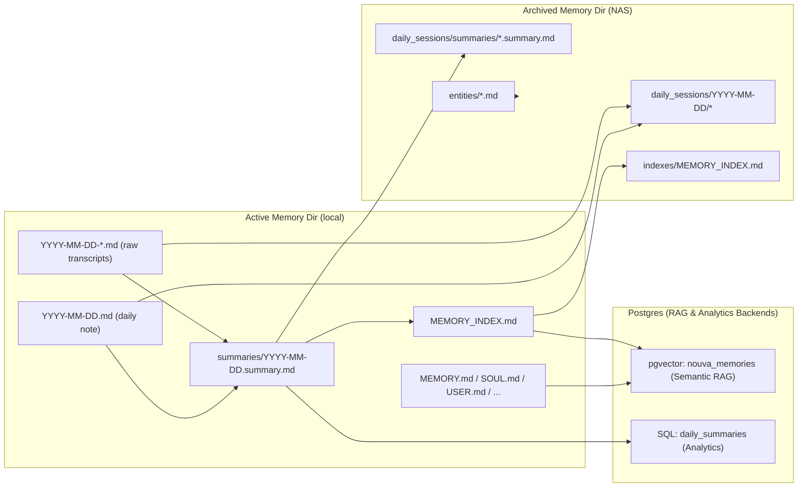
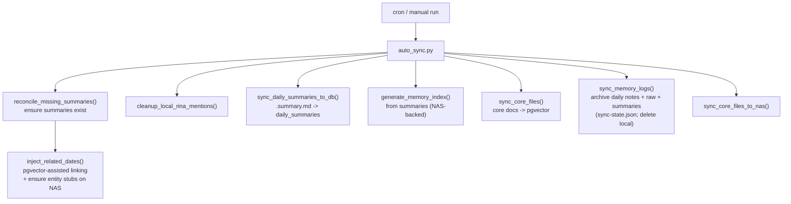
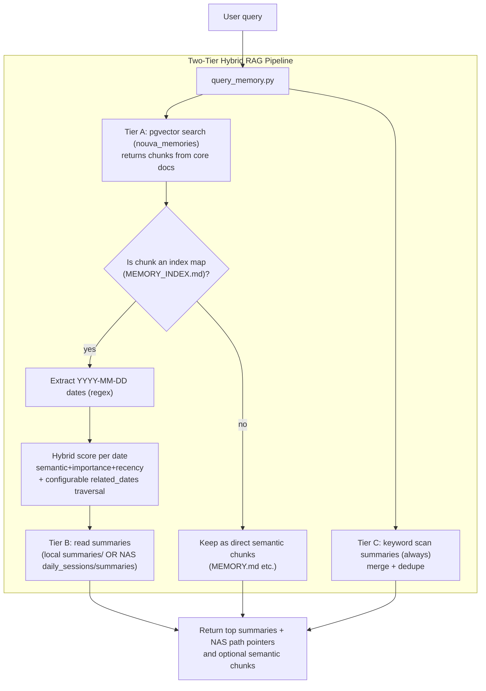
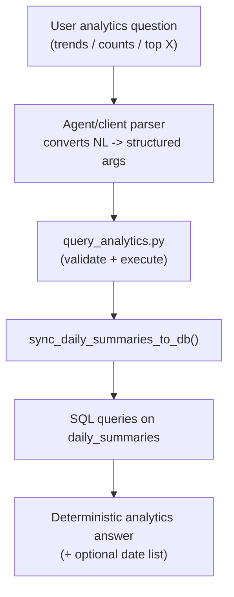

# ARCHITECTURE

This document describes the current memory architecture implemented in the `memory_engine` skill. It focuses on how the system avoids classic RAG failure modes (vector dilution, noisy logs, time-based aggregation inaccuracies) by using a hybrid 2-lane RAG design:

- A semantic recall (RAG) lane backed by Postgres + pgvector (good for “find the relevant day / concept”).
- A deterministic analytics lane backed by plain SQL over structured daily summaries (good for “counts / trends / top X / date lists”).

This document reflects the current codebase only and focuses on the architecture that is implemented today.

---

## 1. Key Concepts (What Exists Today)

### 1.1 Source Files

The system operates on a small set of file types:

- Daily notes: `YYYY-MM-DD.md`
- Raw transcripts: `YYYY-MM-DD-*.md`
- Daily summaries: `summaries/YYYY-MM-DD.summary.md` (Markdown with YAML frontmatter)
- Core knowledge docs: `MEMORY.md`, `SOUL.md`, `USER.md`, `IDENTITY.md`, `AGENTS.md`, `INFRASTRUCTURE.md`, and `MEMORY_INDEX.md`

Daily summaries are the “junction format”: they power both analytics and the memory index.

### 1.2 Storage Backends

#### A. Semantic Recall (Postgres + pgvector)

- Table: `nouva_memories`
- Content: embeddings for core knowledge docs (and the index map docs that help bridge query → date)
- Query method: cosine distance search via raw SQL

Code references:
- Vector table schema: [init_db.py](file:///Users/gadingnst/Workspace/nouverse/nouva-mcp-server/src/skills/memory_engine/scripts/db/init_db.py)
- Vector search implementation: [db_helper.py](file:///Users/gadingnst/Workspace/nouverse/nouva-mcp-server/src/skills/memory_engine/scripts/db/db_helper.py)

#### B. Deterministic Analytics (Postgres SQL)

- Table: `daily_summaries`
- Content: one row per date parsed from `.summary.md` YAML fields (arrays + scalar fields)
- Query method: pure SQL aggregations, with GIN indexes over arrays

Code references:
- Analytics schema + queries: [analytics_repo.py](file:///Users/gadingnst/Workspace/nouverse/nouva-mcp-server/src/skills/memory_engine/scripts/db/analytics_repo.py)
- Sync `.summary.md` → `daily_summaries`: [analytics_sync.py](file:///Users/gadingnst/Workspace/nouverse/nouva-mcp-server/src/skills/memory_engine/scripts/sync/analytics_sync.py)

---

## 2. System Overview Diagram (As Implemented)

---

## 3. Sync Pipeline (auto_sync.py)

The sync process is orchestrated by `auto_sync.py` and is designed to be incremental and idempotent:

- `sync-state.json` is used to drive incremental archival for daily sessions.
- Summaries are reconciled/created before archival, so the summary layer stays available even after local raw files are cleaned.

Code reference:
- Orchestrator: [auto_sync.py](file:///Users/gadingnst/Workspace/nouverse/nouva-mcp-server/src/skills/memory_engine/scripts/auto_sync.py)

### 3.1 Diagram: Sync Steps (High Level)

### 3.2 Note on LLM Usage

Summary generation uses a configurable LLM endpoint/model from `memory_config.json` via [summary_sync.py](file:///Users/gadingnst/Workspace/nouverse/nouva-mcp-server/src/skills/memory_engine/scripts/sync/summary_sync.py). `llm.timeout_seconds` is configurable, while `temperature` currently falls back to the script default when omitted from config. If summaries already exist (pre-generated), the rest of the pipeline still works without calling an LLM.

---

## 4. Retrieval Flow (query_memory.py)

The RAG retrieval path is intentionally hybrid:

- Semantic search (RAG) is used primarily to find candidate dates (via the index map).
- Ranking weights and score decay are loaded from `memory_config.json` under `retrieval.*`.
- Summaries are the primary answer surface (short, clean, low token usage).
- Keyword scanning over summaries is always executed as a safety net.
- Raw transcripts are not automatically loaded; they are exposed via NAS path pointers.

Entry point:
- Tool wrapper: [query_memory.py](file:///Users/gadingnst/Workspace/nouverse/nouva-mcp-server/src/skills/memory_engine/tools/query_memory.py)
- Script: [query_memory.py](file:///Users/gadingnst/Workspace/nouverse/nouva-mcp-server/src/skills/memory_engine/scripts/query_memory.py)

### 4.1 Diagram: RAG Retrieval Tiers

---

## 5. Analytics Flow (query_analytics.py)

Analytics queries should not be answered by semantic search. They are routed to SQL over `daily_summaries` and return deterministic results (counts, distributions, top values, date lists).

`query_analytics.py` is now an executor only:

- It accepts **structured analytics arguments**, not natural-language questions.
- Natural-language parsing belongs in the agent/client layer.
- The server validates the structured payload, syncs `daily_summaries`, then executes SQL or file-backed fallback logic.
- The analytics contract now supports both base intents (`dates_for_value`, `top_values`, `mood_timeseries`, `mood_distribution_by_weekday`) and quick-win aggregate intents (`count_distinct_dates_for_value`, `count_by_period`, `grouped_top_values`, `average_importance`).

Code reference:
- Tool wrapper: [query_analytics.py](file:///Users/gadingnst/Workspace/nouverse/nouva-mcp-server/src/skills/memory_engine/tools/query_analytics.py)
- Script: [query_analytics.py](file:///Users/gadingnst/Workspace/nouverse/nouva-mcp-server/src/skills/memory_engine/scripts/query_analytics.py)

---

## 6. What This Architecture Solves

- Vector dilution in RAG: embeddings focus on core docs and navigational index maps, not raw transcripts.
- Time-based aggregation: handled by structured SQL over `daily_summaries`, not by semantic similarity.
- Token efficiency: summaries are returned as the primary payload; raw logs remain available by path.

---

## 7. Known Operational Risks / Maintenance Notes

- `MEMORY_INDEX.md` can grow continuously; if it becomes too large for good semantic mapping, it should be split (index-of-indexes + topic sub-indexes).
- `memory_config.json` already reserves `multi_level_index_threshold_entries` and `multi_level_index_threshold_kb` for that future `MEMORY_INDEX.md` split/scaling strategy, but those thresholds are not enforced by runtime code yet.
- Append-only logs (for retrieval diagnostics) should have a rotation/retention strategy to avoid becoming a new “bloat file”.
